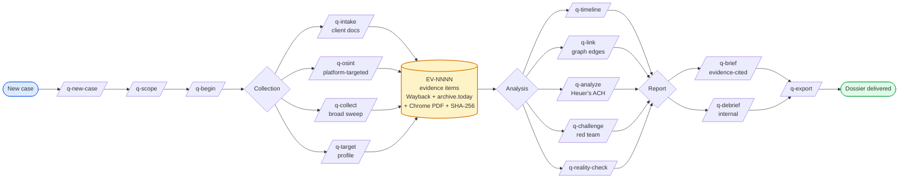
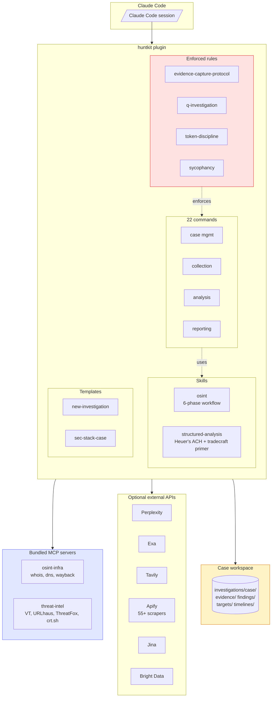

# huntkit

[](https://opensource.org/licenses/MIT)
[](https://claude.com/claude-code)
[](https://github.com/assafkip/huntkit)
[](https://github.com/topics/osint)

Investigation toolkit for [Claude Code](https://claude.com/claude-code). Case management, OSINT, structured analytic techniques, chain-of-custody evidence capture, and bundled MCP servers for infrastructure recon and threat intel.

Not just a scraper wrapper. A full investigation workflow — from case intake to evidence-grade dossier.

**Use it for:** OSINT, due diligence, threat intelligence, incident response, digital forensics, journalistic research, competitive intel, security research, CTF challenges.

## How it works

### Investigation lifecycle



Every URL routes through `capture-evidence.sh`. Every finding cites `[EV-NNNN]`. Every claim has an A-F reliability grade.

### Architecture



## What you get

### Skills

- **`osint`** — 6-phase investigation: tooling check → seed collection → optional internal intel → platform extraction → cross-reference → psychoprofile → completeness scoring → dossier.
- **`structured-analysis`** — CIA tradecraft primer library (Heuer's ACH, key assumptions check, quality of information check, red team, premortem, 66-technique taxonomy). Apache 2.0, upstream [Blevene/structured-analysis-skill](https://github.com/Blevene/structured-analysis-skill).

### Commands (22)

**Case management:** `/q-new-case`, `/q-scope`, `/q-begin`, `/q-status`, `/q-checkpoint`, `/q-handoff`, `/q-end`

**Collection:** `/q-intake`, `/q-collect`, `/q-osint`, `/q-target`, `/q-screenshots`

**Analysis:** `/q-analyze`, `/q-challenge`, `/q-reality-check`, `/q-client-questions`, `/q-timeline`, `/q-link`

**Reporting:** `/q-brief`, `/q-debrief`, `/q-export`

**Specialized:** `/q-sec-stack` (SaaS security stack intel)

### MCP servers (bundled)

- **`osint-infra`** — WHOIS, DNS, reverse DNS, Wayback snapshots / fetch.
- **`threat-intel`** — VirusTotal, URLhaus, ThreatFox, crt.sh certificate transparency.

### Rules (enforced)

- **`evidence-capture-protocol`** — every URL routes through `capture-evidence.sh` (Wayback + archive.today + Chrome PDF + SHA-256 + metadata). Atomic `EV-NNNN-<slug>/` folders. Reports cite by ID.
- **`q-investigation`** — fail-stop on errors, token discipline, state-vs-session file authority, source reliability A-F scale.
- **`token-discipline`** — stop conditions, retry limits.
- **`sycophancy`** — anti-RLHF drift, decision origin tagging.

### Templates

- **`new-investigation/`** — full case scaffold (`canonical/`, `investigation/evidence|findings|targets|timelines/`, `memory/`, `output/`).
- **`sec-stack-case/`** — SaaS security stack investigation template.

## Install

```bash
# In Claude Code
/plugin install assafkip/huntkit
```

Or clone:

```bash
git clone https://github.com/assafkip/huntkit.git
```

## MCP server setup

```bash
cp .mcp.json.template .mcp.json
```

### `osint-infra` (no keys required)

```bash
cd mcp-servers/osint-infra
python3.13 -m venv .venv
source .venv/bin/activate
pip install -r requirements.txt
```

### `threat-intel`

Get free keys:
- VirusTotal: https://virustotal.com/gui/join-us (500 req/day)
- abuse.ch (URLhaus + ThreatFox): https://auth.abuse.ch

```bash
export VT_API_KEY=...
export ABUSE_CH_AUTH_KEY=...
```

## Optional search / scrape APIs

All optional — the skill degrades gracefully. Run `bash skills/osint/scripts/diagnose.sh` to see what's active.

| Env var | Service | Get key |
|---|---|---|
| `PERPLEXITY_API_KEY` | Perplexity Sonar / Deep | https://perplexity.ai |
| `EXA_API_KEY` | Exa semantic search | https://exa.ai |
| `TAVILY_API_KEY` | Tavily agent search | https://tavily.com |
| `APIFY_TOKEN` | Apify scrapers (LinkedIn, IG, TikTok, YouTube, FB pages) | https://apify.com |
| `JINA_API_KEY` | Jina reader / deepsearch | https://jina.ai |
| `PARALLEL_API_KEY` | Parallel AI search | https://parallel.ai |
| `BRIGHTDATA_MCP_URL` | Bright Data MCP (Facebook, LinkedIn, geo-blocked) | https://brightdata.com |

## Optional: Telegram recon

Not bundled — install separately if needed:

```bash
git clone https://github.com/Darksight-Analytics/tgspyder.git
cd tgspyder && pip install -r requirements.txt && pip install -e .
```

## Typical workflow

```
/q-new-case acme-breach
/q-scope          # define question, targets, constraints
/q-begin          # resume session
/q-intake <file>  # ingest client-provided docs
/q-osint linkedin https://linkedin.com/in/someone
/q-collect domain acme.com
/q-target acme-ceo
/q-timeline       # reconstruct event sequence
/q-analyze ach    # analysis of competing hypotheses
/q-challenge      # red team own conclusions
/q-brief          # generate evidence-grounded report
/q-export         # final package
```

Every URL captured routes through the evidence protocol. Every report cites `[EV-NNNN]`. Every claim has an A-F reliability grade.

## Ethics

For:
- Authorized security testing and due diligence
- Journalistic and academic research on public figures
- Defensive threat intelligence and incident response
- CTF / educational contexts

Do not use on private individuals without consent, for harassment, doxxing, or stalking. You are responsible for compliance with local laws and platform terms of service.

## Contributing

Issues and PRs welcome. Backward-compatible additions preferred.

## For LLM agents

See [`llms.txt`](llms.txt) for a machine-readable capability summary with a decision matrix for when to use each skill, command, and MCP server.

## License

MIT. See [LICENSE](LICENSE).

The `skills/structured-analysis/` subdirectory is Apache 2.0 (see `skills/structured-analysis/LICENSE` and `NOTICE.md`).
